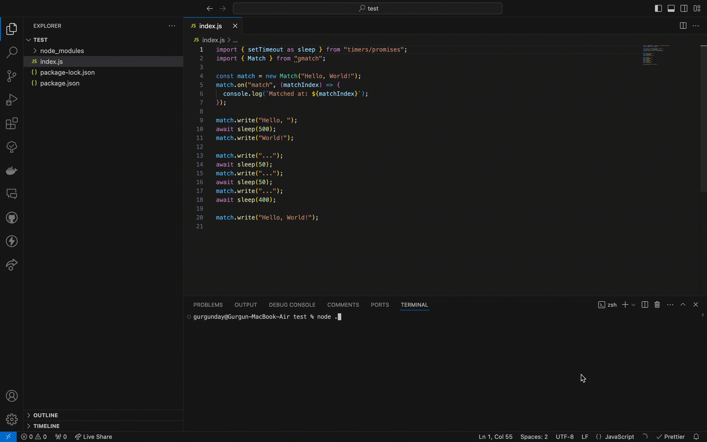

# gmatch 

streamin**gmatch** lets you search for a pattern in a stream as fast as JavaScriptly possible.

Works in the browser. No runtime dependencies. Constant memory usage. [Faster than streamsearch.](#benchmarks)



## Installation

```sh
npm i gmatch
```

Or import directly from a CDN:

```js
import { Match } from "https://cdn.jsdelivr.net/npm/gmatch/+esm";
```

## API

### `Match`

The `Match` class implements a streaming Boyer-Moore-Horspool-Sunday (BMHS) pattern matching algorithm.

#### Constructor

```js
new Match(pattern, callback);

new Match(pattern, callback, Buffer.from);
```

- `pattern` (Uint8Array|string): The pattern to search for. Must be between 1 and 256 characters long.
- `callback` (Function): The function to be called when there's a match or when a chunk of data is processed.
- `from` (Function, optional): Custom `Buffer.from` implementation for runtimes like Node.js. Defaults to an internal, browser-compatible function.

The constructor may throw:

- `TypeError`: If the callback is not a function or if the pattern is not a string.
- `RangeError`: If the pattern is empty.

#### Properties

- `matches` (number): Returns the number of matches found.
- `lookbehindSize` (number): Returns the size of the fed data that hasn't yet been processed.

#### Methods

- `destroy()`: Calls the callback with any remaining lookbehind data and calls `reset()`.
- `reset()`: Resets the internal state.
- `write(chunk: Uint8Array|string)`: Feeds a chunk of data.

#### Callback Parameters

- `isMatch` (boolean): Indicates whether a match is found.
- `data` (Uint8Array | null): Buffer containing data that is not part of a match.
- `start` (number): The start index of the data that doesn't contain the pattern.
- `end` (number): The end index (exclusive) of the data that doesn't contain the pattern.
- `isSafe` (boolean): Indicates whether it's safe to store a reference to `data` without copying it.

## Usage

```js
import { Match } from "gmatch";

const matcher = new Match("example", (isMatch, data, start, end, isSafe) => {
  console.log(isMatch, data, start, end, isSafe);
});

matcher.write("Some text with an example in it");
matcher.write(" and more exam");
matcher.write("ple here");
matcher.destroy();

console.log(`Total matches: ${matcher.matches}`);
```

You can use the `Match` class with various types of data sources, including streams, by calling the `write` method with chunks of data as they become available.

The implementation is optimized for both Node.js environments (Buffer) and browser environments (Uint8Array).

## Benchmarks

Latest results:

```sh
┌─────────┬────────────────┬───────────┬────────────────────┬──────────┬─────────┐
│ (index) │ Task Name      │ ops/sec   │ Average Time (ns)  │ Margin   │ Samples │
├─────────┼────────────────┼───────────┼────────────────────┼──────────┼─────────┤
│ 0       │ 'gmatch'       │ '327,280' │ 3055.4854687296574 │ '±0.15%' │ 1636402 │
│ 1       │ 'streamsearch' │ '289,082' │ 3459.2213706394214 │ '±0.15%' │ 1445413 │
└─────────┴────────────────┴───────────┴────────────────────┴──────────┴─────────┘

gmatch matches: 12
streamsearch matches: 12
```

## Acknowledgments

Inspired by the excellent streamsearch package, both of which implement [FooBarWidget's streaming Boyer-Moore-Horspool algorithm](https://github.com/FooBarWidget/boyer-moore-horspool/blob/10e25ed66f7184a982fbe9239a8f46ac4969643c/StreamBoyerMooreHorspool.h).
