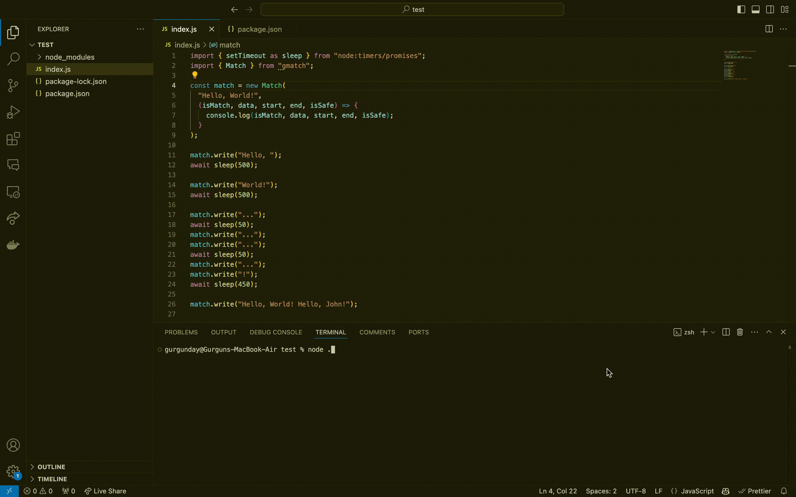

# gmatch 

streamin**gmatch** lets you search for a pattern in a stream, as fast as JavaScriptly possible.

Works in the browser. No runtime dependencies. Constant memory usage. [Faster than streamsearch.](#benchmarks)



## Installation

```sh
npm i gmatch
```

## API

### `Match`

The `Match` class implements a Boyer-Moore-Horspool-Sunday (BMHS) pattern matching algorithm for efficient string searching.

#### Constructor

```js
new Match(pattern, callback);

new Match(pattern, callback, Buffer.from);
```

- `pattern` (string): The pattern to search for. Must be between 1 and 256 characters long.
- `callback` (function): The function to be called when there's a match or when a chunk of data is processed.
- `from` (function, optional): Native or custom `Buffer.from` implementation for runtimes like Node.js. Defaults to an internal, browser-compatible function.

The constructor may throw:

- `TypeError`: If the callback is not a function or if the pattern is not a string.
- `RangeError`: If the pattern length is not between 1 and 256 characters.

#### Methods

- `reset()`: Resets the internal state of the matcher.
- `destroy()`: Cleans up and calls the callback with any remaining data.
- `write(chunk)`: Processes a chunk of data, searching for matches.

#### Properties

- `matches`: Returns the number of matches found.

## Usage

```js
import { Match } from "gmatch";

const matcher = new Match(
  "example",
  (isMatch, bufferIndex, matchIndex, lookbehind, currentBuffer) => {
    if (isMatch) {
      console.log(`Match found at index: ${matchIndex}`);
    } else {
      console.log(`Processed ${matchIndex - bufferIndex} bytes`);
    }
  },
);

matcher.write("Some text with an example in it");
matcher.write(" and more exam");
matcher.write("ple here");

matcher.destroy();

console.log(`Total matches: ${matcher.matches}`);
```

You can use the `Match` class with various types of data sources, including streams, by calling the `write` method with chunks of data as they become available.

The implementation is optimized for both Node.js environments (Buffer) and browser environments (Uint8Array).

## Benchmarks

Latest results:

```sh
┌─────────┬────────────────┬───────────┬────────────────────┬──────────┬─────────┐
│ (index) │ Task Name      │ ops/sec   │ Average Time (ns)  │ Margin   │ Samples │
├─────────┼────────────────┼───────────┼────────────────────┼──────────┼─────────┤
│ 0       │ 'gmatch'       │ '287,789' │ 3474.757510684889  │ '±0.33%' │ 719475  │
│ 1       │ 'streamsearch' │ '280,600' │ 3563.7901000848046 │ '±0.26%' │ 701501  │
└─────────┴────────────────┴───────────┴────────────────────┴──────────┴─────────┘
gmatch matches: 12
streamsearch matches: 12
```

## Acknowledgment

Inspired by the excellent streamsearch package, both of which implement [FooBarWidget's streaming Boyer-Moore-Horspool algorithm](https://github.com/FooBarWidget/boyer-moore-horspool/blob/10e25ed66f7184a982fbe9239a8f46ac4969643c/StreamBoyerMooreHorspool.h).
